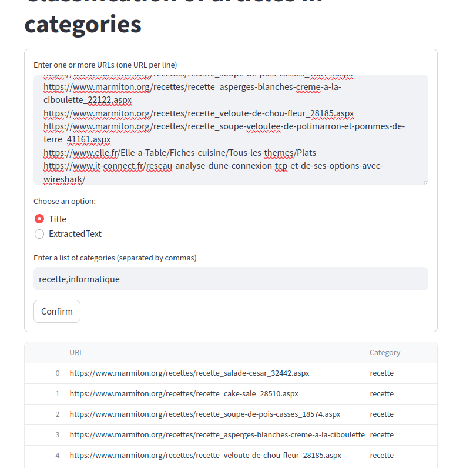

# Article to category

## Article Classifier

This project provides a solution for the automatic classification of online articles into predefined categories. Using a combination of FastAPI for the backend and Streamlit for the user interface, the project allows users to enter article URLs and receive back the most relevant categories based on the extracted content. 

Classification is achieved by integrating machine learning models via the Transformers library, in particular the **mDeBERTa-v3-base-mnli-xnli** model for zero-shot classification.
## Demo



### Main features
- Content Extraction: Using trafilatura, the system efficiently extracts relevant content from supplied URLs, ignoring superfluous elements such as comments and tables.
- Zero-Shot Classification: Uses zero-shot classification techniques to categorise extracted content into user-defined categories, without requiring the model to be specifically trained on these categories.
- User Interface: With Streamlit, the project offers a simple user interface, allowing users to easily submit URLs and specify categories for classification.

### Installation

Instructions for installing and running your project locally. Include steps to install dependencies, configure the environment and start the servers for FastAPI and Streamlit.
```bash
git clone https://github.com/drogbadvc/article-to-category.git

cd article-to-category

# Install dependencies
pip install -r requirements.txt

# Start the FastAPI server
uvicorn main:app --reload

# In another terminal, start the Streamlit user interface
streamlit run streamlit_app.py

```

### Credit

[@AndellDam](https://twitter.com/AndellDam)
